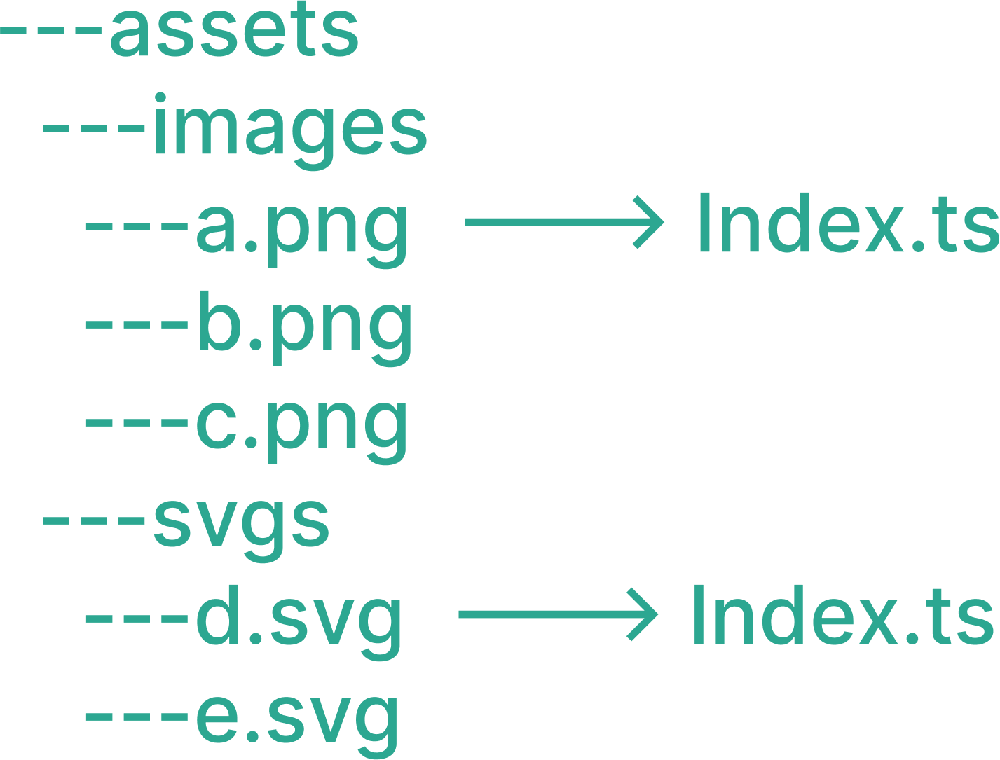

# auto-export

A cli can automatically export files of the same type

[](https://www.npmjs.com/package/sudongyuer/auto-export)

<p align='center'>

</p>

## Why

When you want to export many files of the same type in one folder, you may cost a lot of time to `copy and paste` the same code. eg if you want to export all `images `in one folder, you need to copy and paste the same code for each image, and export these images in a `index.ts` file.

## Usage

### Install

```ball
pnpm add -D auto-export
```

### Config `export.config.ts`

- targetDir  : the directory to export files

- outputDir : the directory to generate the `index.ts` file to export files

```js
import { defineExportConfig } from '@sudongyuer/auto-export'
export default defineExportConfig({
  configs: [
    {
      targetDir: './src/assets/images',
    },
    {
      targetDir: './src/assets/css',
      outputDir: './src/assets/css',
    },
    {
      targetDir: './src/assets/svgs',
      customImport: (fileName, file) => {
        return `import { ReactComponent as ${fileName} } from '${file}'`
      },
    },
  ],
})

```

### Generate `index.ts`

```bash
pnpm run autoexport
```

## Author

sudongyuer email:976499226@qq.com

## License

[MIT](./LICENSE) License © 2021 [SuDongYu](https://github.com/sudongyuer)
